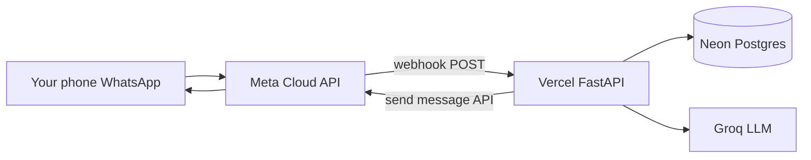

# Vercel + WhatsApp Cloud API — working demo

Repo: [github.com/sameerasif189/AI-support-agent](https://github.com/sameerasif189/AI-support-agent)

End-to-end guide: deploy this repo to Vercel, connect Meta’s free WhatsApp test number, and chat with the same ERP support bot as the web UI.

## What you are building



---

## Part A — Accounts and keys (do once)

### 1. Neon Postgres (free)

1. Sign up at [https://neon.tech](https://neon.tech) and create a project.
2. Copy the **pooled** connection string (`…-pooler…neon.tech`). Ensure it ends with `?sslmode=require`.
3. In Neon SQL editor or `psql`, run these files **in order** from this repo:
   - `scripts/init_schema.sql`
   - `scripts/migrate_kb_rag_fts.sql`
   - `scripts/migrate_customer_memory.sql`
   - `scripts/migrate_pgvector_rag.sql`
   - `scripts/migrate_auth_rag.sql` (if present)
   - `scripts/migrate_chat_history.sql` (if present)
4. Seed demo data (from your PC, with `DATABASE_URL` set):

   ```powershell
   cd "c:\Users\PC\AI Support agent"
   $env:DATABASE_URL = "postgresql://..."
   python scripts/seed_db.py
   ```

   Optional but recommended for RAG: set `EMBEDDING_API_KEY` (OpenAI) and run `python scripts/reindex_vector_rag.py`.

### 2. Groq LLM (free)

1. [https://console.groq.com](https://console.groq.com) → API key.
2. You will set on Vercel:
   - `LLM_API_BASE=https://api.groq.com/openai/v1`
   - `LLM_API_KEY=gsk_...`
   - `LLM_MODEL=llama-3.1-8b-instant`
   - `LLM_ORDER=api` (no GPU on Vercel)

### 3. Meta WhatsApp Cloud API (free test number)

1. [https://developers.facebook.com](https://developers.facebook.com) → **Create app** → type **Business**.
2. Add product **WhatsApp** → **API Setup**.
3. Note from the page:
   - **Temporary access token** (copy; expires in ~24h — regenerate for long demos)
   - **Phone number ID** (numeric, not the display phone number)
   - **WhatsApp test number** Meta gives you
4. Under **Configuration** → Webhook (you will fill URL after Vercel deploy):
   - **Verify token**: pick a secret string, e.g. `my-erp-demo-verify` — must match `WHATSAPP_VERIFY_TOKEN` on Vercel.
   - Subscribe to **messages** field.
5. **Add your personal number** as a test recipient (API Setup → “Send and receive messages” → manage phone list). Only listed numbers can message the bot in test mode.

### 4. GitHub (for Vercel deploy)

Vercel imports from Git. If this folder is not a repo yet:

```powershell
cd "c:\Users\PC\AI Support agent"
git init
git add .
git commit -m "Initial commit for Vercel WhatsApp demo"
```

Create a repo on GitHub and push (replace URL with yours):

```powershell
git remote add origin https://github.com/YOUR_USER/YOUR_REPO.git
git branch -M main
git push -u origin main
```

---

## Part B — Deploy to Vercel

### 1. Import project

1. [https://vercel.com](https://vercel.com) → **Add New** → **Project** → import your GitHub repo.
2. Framework preset: **Other** (Python is driven by `vercel.json`).
3. Root directory: repo root (default).

### 2. Environment variables

In Vercel → Project → **Settings** → **Environment variables**, add:

| Variable | Example / notes |
| -------- | ---------------- |
| `DATABASE_URL` | Neon pooled URL |
| `LLM_API_BASE` | `https://api.groq.com/openai/v1` |
| `LLM_API_KEY` | Groq key |
| `LLM_MODEL` | `llama-3.1-8b-instant` |
| `LLM_ORDER` | `api` |
| `RAG_FEED_SYNC_ENABLED` | `false` (background sync does not run on serverless) |
| `LOCAL_LLM_PRELOAD` | `false` |
| `WHATSAPP_ACCESS_TOKEN` | Meta temporary token |
| `WHATSAPP_PHONE_NUMBER_ID` | From Meta API Setup |
| `WHATSAPP_VERIFY_TOKEN` | Same string you will enter in Meta webhook UI |
| `WHATSAPP_DEMO_ERP_UID` | `1` (maps all WhatsApp chats to seeded customer **cust1**) |
| `EMBEDDING_API_KEY` | Optional; OpenAI key if you use vector RAG |

Redeploy after saving env vars (**Deployments** → ⋮ → **Redeploy**).

### 3. Confirm deploy

Your app URL will look like `https://erp-ai-support-xxxx.vercel.app`.

Check:

- `GET https://YOUR_APP.vercel.app/health` → JSON with `"database": true` if `DATABASE_URL` is correct.
- `GET https://YOUR_APP.vercel.app/integrations/whatsapp/status` → `whatsapp_send_configured: true` when Meta tokens are set.
- `GET https://YOUR_APP.vercel.app/` → web chat UI (optional).

**Local prep:** set `DATABASE_URL` in `.env`, then:

```powershell
powershell -ExecutionPolicy Bypass -File scripts/setup_vercel_whatsapp_demo.ps1
```

Copy env vars from `vercel.env.example` into the Vercel dashboard.

---

## Part C — Connect WhatsApp webhook

### 1. Register webhook in Meta

WhatsApp → **Configuration** → **Webhook**:

| Field | Value |
| ----- | ----- |
| Callback URL | `https://YOUR_APP.vercel.app/channels/whatsapp` |
| Verify token | Exact match for `WHATSAPP_VERIFY_TOKEN` |

Click **Verify and save**. Meta sends `GET` with `hub.challenge`; the app echoes it if the token matches.

Subscribe to **messages**.

### 2. Test from your phone

1. On your phone, open WhatsApp and message the **Meta test business number** (shown in API Setup), not your bot’s old chats unless that number is the test line.
2. Send: `What is my highest order?`
3. You should get a short ERP-aware reply within a few seconds.

If nothing arrives:

- Vercel **Functions** → logs for `/channels/whatsapp`
- Meta **Webhook** → recent deliveries (retry / error codes)
- Token expired → generate a new temporary token and update `WHATSAPP_ACCESS_TOKEN` on Vercel, redeploy
- Your phone not in **test recipient** list
- `WHATSAPP_PHONE_NUMBER_ID` wrong (must be Phone number ID, not WABA id)

### 3. Smoke test (curl or script)

```powershell
powershell -ExecutionPolicy Bypass -File scripts/smoke_whatsapp.ps1 -BaseUrl https://YOUR_APP.vercel.app
```

Or curl legacy test body (does not send to a real phone; exercises the same bot logic):

```powershell
curl -X POST "https://YOUR_APP.vercel.app/channels/whatsapp" `
  -H "Content-Type: application/json" `
  -d '{\"from\":\"1\",\"message\":\"What are your support hours?\"}'
```

---

## Part D — Demo behavior

- All WhatsApp users are treated as ERP customer id **`WHATSAPP_DEMO_ERP_UID`** (default `1` = login **cust1** / password **Alex** on web).
- Change demo customer: set `WHATSAPP_DEMO_ERP_UID=2` on Vercel and redeploy.
- Web chat at `/` uses login; WhatsApp skips login and uses the demo customer mapping.
- Replies are capped by `config/guardrails.json` (short answers, budget limits).

---

## Part E — Costs and limits

| Service | Demo cost |
| ------- | --------- |
| Vercel Hobby | Free tier (watch serverless execution limits) |
| Neon | Free tier |
| Groq | Free tier with rate limits |
| Meta WhatsApp | Test number + limited free service conversations; renew temp token often |

Production WhatsApp billing is per Meta conversation rules; this guide is for **test / demo** only.

---

## Part F — Checklist

- [ ] Neon schema + `seed_db.py`
- [ ] Groq API key on Vercel
- [ ] `LLM_ORDER=api`, `RAG_FEED_SYNC_ENABLED=false`
- [ ] GitHub push + Vercel deploy green
- [ ] `/health` shows `database: true`
- [ ] Meta webhook verified (green check)
- [ ] `messages` subscribed
- [ ] Personal number added as test recipient
- [ ] WhatsApp message → bot reply

---

## Troubleshooting

| Symptom | Fix |
| ------- | --- |
| Webhook verify fails | `WHATSAPP_VERIFY_TOKEN` must match Meta UI exactly; redeploy |
| 401 / invalid signature | Set `WHATSAPP_APP_SECRET` from Meta app settings, or leave secret empty for demo |
| Empty ERP answers | Set `WHATSAPP_DEMO_ERP_UID=1` and confirm `DATABASE_URL` + seed |
| Timeout on Vercel | Groq slow or cold start; retry; upgrade plan for longer function timeout |
| Token expired | Meta → new temporary token → update Vercel env → redeploy |
